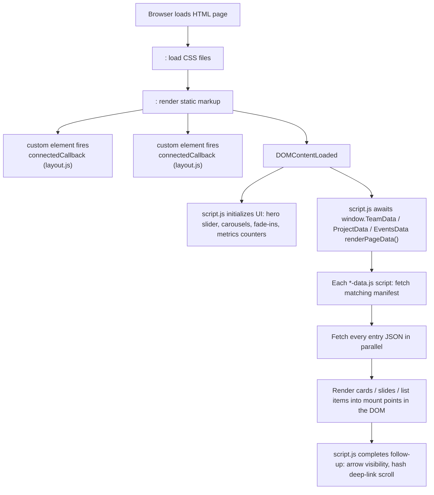

# Architecture

This document explains how the website is put together at a conceptual level. After reading it, you should understand how a single HTML page goes from "static markup" to "fully populated UI" without ever needing a build step.

## Static-site model

The project has no `package.json`, no bundler, no preprocessor. Every file you see is exactly what the browser receives. To deploy the site you upload the folder. To preview it locally you open an HTML file in a browser (or run a tiny static server like VS Code's Live Server extension if you need fetch() to work, since fetching JSON over `file://` is blocked in some browsers).

Trade-offs of this approach:

- **Easy to maintain:** Anyone who can edit JSON, HTML, or CSS can contribute. No tooling to install.
- **Slower iteration on shared logic:** Changes to `JS/script.js` or `JS/layout.js` require manual cache-buster bumps on every page (see [`CONVENTIONS.md`](CONVENTIONS.md#cache-busters)).
- **No type checking:** JSON shape mistakes only surface at runtime in the browser console. Each domain has a documented schema in [`DATA_MODEL.md`](DATA_MODEL.md) — follow it.

## The four data domains

Each "thing the site shows you" comes from one of four data domains, and each domain has the same shape on disk: a `manifest.json` that lists files, plus per-entry JSON files.

| Domain | Manifest | Entry folders | What it powers |
|---|---|---|---|
| People | `People/manifest.json` | `People/<group>/*.json` (six groups) | Homepage team carousels and the Our Team page |
| Projects | `Projects/manifest.json` | `Projects/Featured/*.json`, `Projects/Page/*.json` | Homepage hero slides and the Projects page grid |
| Events | `Events/manifest.json` | `Events/*.json` | The Events block on the homepage |
| Jobs | `Jobs/manifest.json` | `Jobs/*.json` | The Opportunities page |

The manifest pattern matters: **a JSON file that is on disk but missing from its manifest is silently ignored**. Always update the manifest when you add a new file.

## Page lifecycle

When a browser loads any page, this happens in order:



Notes:

- `JS/site-config.js` runs **before** any other script and sets `window.RadiantSiteConfig.assetVersion`, used as the `?v=` query string on every JSON fetch so updates aren't served stale.
- `JS/layout.js` defines `<site-header>` and `<site-footer>` as custom elements; the HTML pages just include `<site-header></site-header>` once and the component injects the navigation, hamburger toggle, and footer.
- `JS/jobs-data.js` is the one exception to the orchestration model — it does not register on `window`, it just listens for `DOMContentLoaded` and fills `#jobsBoard` itself.

## Where to start when you need to change something

| Goal | Start here |
|---|---|
| Add a new person, project, event, or job | [`guides/`](guides/) |
| Tweak how a card or section looks | The relevant per-page CSS in `CSS/` (see [`CSS_GUIDE.md`](CSS_GUIDE.md)) |
| Change navigation links or footer | `JS/layout.js` (the strings inside `connectedCallback`) |
| Change behavior of the hero slider, carousels, or scroll animations | `JS/script.js` |
| Change how team sections collapse / expand | `JS/team-data.js` (look for `TEAM_SECTION_PREVIEW_COUNT`, `applyCollapseState`) |
| Add a brand-new page | Copy an existing simple page (e.g. `Donate.html`), update the `<title>`, swap the page-specific stylesheet/script tags, point the new nav link from `JS/layout.js` |
| Replace a hero/banner image | [`guides/swap-page-image.md`](guides/swap-page-image.md) |
| Bump cache-busters after editing CSS or JS | [`CONVENTIONS.md`](CONVENTIONS.md#cache-busters) |

## Key conventions in one breath

- **Cache busters** look like `?v=2026-04-29-2`. Bump these whenever you edit a CSS or JS file so users don't get the cached version. The full procedure is in [`CONVENTIONS.md`](CONVENTIONS.md).
- **Person URL hashes** look like `Our_Team.html#first-last`. The slug is generated from the person's name by `personKeyFromName` in `JS/team-data.js`. Cards on the homepage link to these hashes; the team page auto-expands the right section and scrolls to the matching card.
- **Image variants** for headshots (`Images/People/variants/card/<basename>.webp` and `.../team/<basename>.webp`) are **not** auto-generated by anything in the repo. You must produce them manually when adding a new headshot. See [`guides/create-image-variants.md`](guides/create-image-variants.md). If a variant is missing, the original image is used.
- **Manifest-driven loading** means a new entry JSON only takes effect once it's listed in the matching manifest.

## File-and-folder map

```
Radiant_Dev/
  *.html                 7 active pages at the project root
  CSS/                   8 stylesheets — see CSS_GUIDE.md
  JS/                    7 scripts — see JS_GUIDE.md
  Images/
    *.jpg / *.png        Page banners, hero backdrops
    People/              Headshot base files
      variants/card/     WebP variant for homepage carousel cards
      variants/team/     WebP variant for the Our Team page
    News/                Project / story imagery
    Events/              Event photos
  People/
    manifest.json
    Leadership/                       Six folders, one per role group
    Core Researchers/
    Affiliation/
    Staff/
    Postdoctoral Scholars/
    Graduate Students & Assistants/
  Projects/
    manifest.json
    Featured/            JSON used for homepage hero slides
    Page/                JSON used for the Projects page grid
  Events/
    manifest.json
    *.json
  Jobs/
    manifest.json
    *.json
  docs/                  This folder
  README.md              Project intro
```
